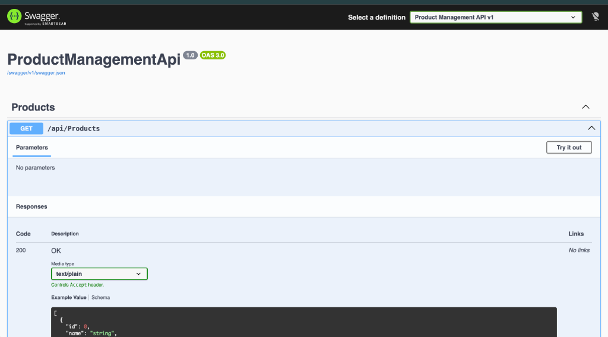
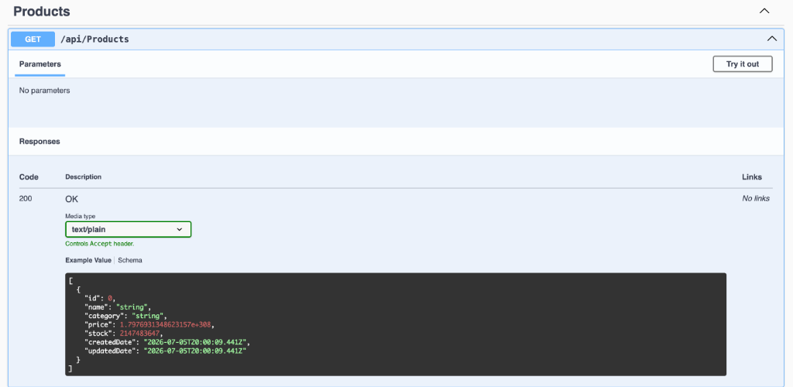
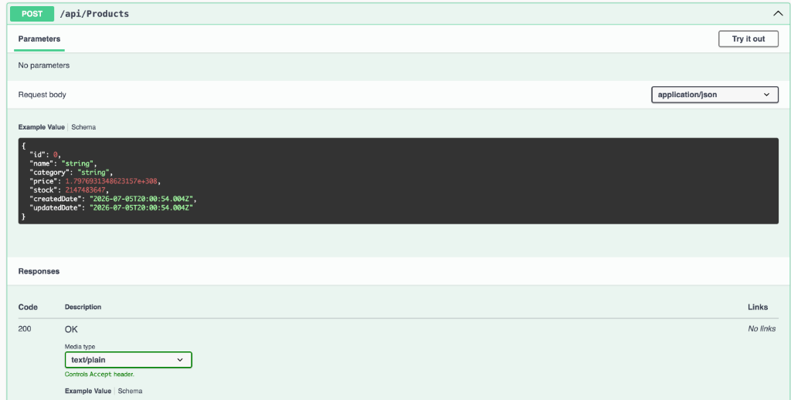
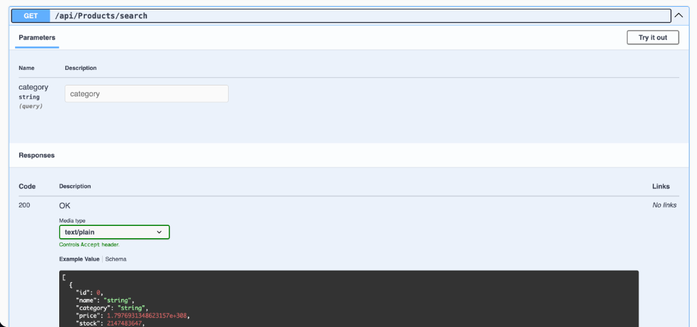

# Product Management API
   The application will start and listen on:
   - `http://localhost:5026`

 **Explore the Swagger UI:**
   Open your browser and navigate to:
   - [http://localhost:5026/swagger](http://localhost:5026/swagger)

---

## API Documentation & Screenshots

Below are screenshots demonstrating the interactive Swagger UI and various API endpoints in action:

### 1. Swagger UI Dashboard
Overview of the interactive Swagger UI presenting the product management endpoints.

### 2. GET /api/Products
Retrieving the list of products from the database.

### 3. POST /api/Products
Creating a new product.

### 4. GET /api/Products/search
Filtering products by category query parameter.

